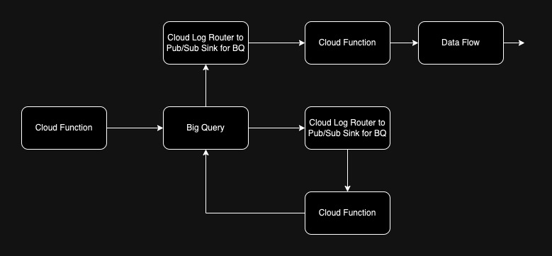

# Introduction 

Introducting the use of Bigquery for analytical workloads. Below is a summarized notes for what i have learnt about Big query as a technology and how I have explored using it.

# Partitions 

## SQL partitions Clause Understanding 

Before diving into the use of Big Query Partitionns, lets understand Partitions used in standard SQL. 

We know that `Group By` results in reducing the number of rows and it is often used in conjunction to aggregated functions. Similarity to `Partitions`. The only difference is that the returned Partition value is calculated for all rows. 

Take for example the two queries below :

| Query 1 with `Group By` | Query 2 with `partititons` |
| --- | ---|
| ```SELECT name, AVG(score) AS average_score FROM Students GROUP BY name``` | ```SELECT name, subject ,AVG(SCORE), score AS average_score OVER (PARTITION BY name) FROM Students``` |

` Query 1 Result `
| name | average_score |
| --- | --- |
| Luffy | 100 | 
| Kid | 80 |


`Query 2 Result `

| name | subject | average_score | score |
| --- | --- | --- | --- |
| Luffy | English | 95 | 100 |
| Luffy | Math | 95 | 90 |
| Kid | English |85 | 90 | 
| Kid | Math | 85 | 80 |
 
Notice : 
- For partitions, it is done for each record 
- Group by reduce the number of rows present 

Overall, the partititions we create in BQ are relating to table partitioning unlike that of creating an aggreagated column but it is also similar as BQ uses aggregated indicator of sorts to signify a partiton. That is why i included this section.

## Big Query partitions Understanding 

The concept of partitions was first introduced when we discuss about creating partitioned tables. The cost of big query araise from reading and writing queries that work on a large dataset. 

Thus, table partitioning sorta creates a filter for BQ qeuries to sieve through only the partition it needs to work on. BQ refers to this process as pruning. Hence **Pruning helps improves cost and improve query performance**

According to https://cloud.google.com/bigquery/docs/partitioned-tables you can also : 
- Set expiration on partitions 
- Write / Delete to specific partitions 

You can partition tables based on : 
- Range of Integer values on an integer column (Specify start, end, range for each partition)
- Time column partitioning (one of the most common types used in my experience), hourly, daily, monthly, yearly granularity.
  - `__NULL__` partitioned table is used rows with missing Time unit and Unpartitioned is used for rows where values are invalid
- Ingestion time partitioning 
  - `_PARTITIONTIME` & `_PARTITIONDATE` is a column created with the value representing the truncated datetime or date grandularity level respectively. Especially useful when monitoring ingestion over time.
  - Note about the number of partititons created given a grandularity level. There could be a limit set onn the number of partition tables able to be created 

Theese are the three kinds of table partitions mentioned by the Big Query documentation. I am sure there are more but i will not dive into them. We will only pick one of the examples, i will explain how its generally used from my experience and break down the query.

### Example Table 

Senario : Imagine that data is meant for a 

| column name | type | Example |
| --- | --- | --- |
| transaction_id | INT | 1 |
| transaction_ts | TIMESTAMP | 2023-08-10 15:00:02
| app_meta_info | REPEATED | {"config":"/project/folder_conf/mstconfig.config", "user_log_ts":"2023-08-10 14:45:05"... } |


### Creating Partitioned Tables in BQ using SQL

```

CREATE TABLE
  `project.exampledataset.exampletable_partitionned` 
  ( 
   action_id INT64
  ,action_ts TIMESTAMP
  ,app_meta_info REPEATED
  )

PARTITION BY
  TIMESTAMP_TRUNC(action_ts, DAY) 
  // or DATE_TRUNC(_PARTITIONTIME, MONTH)

OPTIONS(
  partition_expiration_days = 7,
  require_partition_filter = TRUE
)

AS(
  SELECT
    action_id, action_ts, app_meta_info
  FROM
    `project.exampledataset.exampletable`
  WHERE YEAR(action_ts)  > 1990 
);
```
***Please excuse the above untidy query, i split it up for explaination***
### Architecture and Explaination of use case

Assuming this is a table representing a logging system that tracks application and user system related activity. Ingestion partition is particularly convienent when we are dealing with a daily ingestion of logs. 

Log activity can be rather large in a day, usually we will combine this with clustering but for this example i will explain the query and provide a proposed architecture of partitioning for tables. 

Note that while a noSQL datastore can be used for this because it can store non structured data better, we can make use of Big Query partitioning functions and analytical capaiblities. 

In accordance with the spaces : 
1. Create a table of the following columns `action_id INT64 ,action_ts TIMESTAMP ,app_meta_info REPEATED`. We must have a timestamp or date column to allow partitioninng by the Hour,Day,Month
2. We can also partition by ingestioning time to BIGQUERY. `_PARTITIONTIME` is an automatically created column upon data ingestion into this table 
3. We set some options to expire the table after a certain period of time and allow a partititioning filter to be set to perform pruning
4. We can create a partitioned table out of an existing table if we wannt to avoid the query from certain timeframes or other kinds of conditions you wish. 

This architecture can create a partititioned table that can be removed after a certain period of time once processed. A simple processing architecture could be as seen below :



The purpose of this is to provide a weekly update of system logs to a team of engineers that are monitoring a new service functionality. When data is ingested into big query from upstream, the stack driver logs are pushed, a cloud log router can be created to trigger cloud function. This cloud function can help create partitions.  

We can further trigger a cloud function using the same design to perform a data processing step using data flow and procceed downstream (which is its left blank and depending to your needs).


# Arrays and Structs 

Arrays and Structs are one of the concepts I came across when exploring the uses of Big Query. It was introduced as sorta like an in between concept of normalization (slower with joins but higher integrity) and denormalization (faster without joins lower integrity). 

It proposes how it is efficient by storing tables in tables or by letting cells hold multiple values. This reduces the number of rows and lesser number of tables to maintain.  

## Arrays & UNNEST() Operator

Arrays are `REPEATED` field type.
 
 ---
### Creating Arrays 

Below is a simple example of how Arrays are like in tables.

```
Create or Replace TABLE "Students" as (
Select "Luffy" as name, ["English","Chinese","Tamil"] as languages 
UNION ALL
Select "Kid" as name, ["English","Chinese","Tamil"] as languages 
)
```
---
### Array Funcs 

#### ARRAY_AGG(): 
Aggregate our string values into an array. We usually would want to use this to make each row unique by concatenating string values and represent it with a group. For example, given `Students` table 

| name | language |
| --- |---|
| Kid | English |
| Kid | Chinese |
| Kid | Tamil |
| Kid | Chinese |


```
SELECT name,
ARRAY_AGG( DISTINCT language ORDER BY language LIMIT 5) AS students_language
ARRAY_LENGTH(ARRAY_AGG( DISTINCT language)) as students_no_languages
FROM Students 
GROUP BY name
```

| name | students_language | students_no_languages |
| --- |---| ---|
| Kid | [English,Chinese,Tamil] | 3

Notice : 
1. `DISTINCT` was used to remove duplicates for each repeating row 
2. `ARRAY_LENGTH` and `ARRAY_AGG` was used to combine rows pertaining to student name group into a single cell and to get the length of that array respectively 
3. `GROUP BY` was used in coherent with aggregate functions like `ARRAY_AGG`
4. Notice : `ARRAY_AGG( DISTINCT language ORDER BY language LIMIT 5)` This shows that ARRAY_AGG can also be used with `ORDER BY` and `LIMIT`

While array aggregation is straight forward, querying them is slight more complex.

---
#### UNNEST()

UNNEST() arrays to bring the array elements back into rows. How it is done in the arrays is similar to a `cross join` where the first table is cross joined to the next but can 'cut short the query'

Quoted by Google :
> UNNEST() always follows the table name in your FROM clause (think of it conceptually like a pre-joined table) 

Given a schema 

| column name | Type | 
| ---| ---|
name | STRING
students.language_arr | REPEATED

```
SELECT s.name, l.language
FROM Students AS s , 
UNNEST(students.language_arr) AS l
```
Notice : 
1. A `,` is used instead of a `cross join` 
2. `UNNEST()` first unpacks the array and treat the unpacked array as a table with an alias (its good practice to have).
3. Using the alias, we can treat it like another seperated table
4. To rename as column use `UNNEST(select * from unnest(x) as v)` this will name the unnested array column v


## STRUCT 

Is sorta way to create a sub table in a query. It is a `RECORD` type also referred to as nested fields.

Before starting, we should understand how does a struct look like in Big Query Tables. 

| class | students.name | students.grade |
| --- | --- | --- |
| A | Luffy | 80 |
| | Kid | 90
|B |Usopp| 100|
||Nami|80| 

Notice  
1. 

Example 
```
Select name
STRUCT(name, language) as student_info
from Students
```

### Querying Struct 

To query a struct, we can just select it. TO query a column in a struct would be as follow 

```
Select s.name, r.language
from Students as s, s.student_info as r
```

### More Complex Situations 

1. Unnest a struct 

Remember when unnesting a struct we are unnesting the table to be one for each row. To make a table looking normal, we can treat the `STRUCT` like a table to performa `Cross Join`. 

```
SELECT class, students.name
FROM Classes
CROSS JOIN
Students
```

| class | students.name | students.grade |
| --- | --- | --- |
| A | Luffy | 80 |
| A | Kid | 90
|B|Usopp| 100|
|B|Nami|80| 

Lets break it down even further. Lets take a query like 

```
#standardSQL
SELECT
  s.name,
    grade
FROM Class AS c
, UNNEST(c.Students) AS s
, UNNEST(s.grade) AS grade
WHERE grade = 80;
```
and a table example like 

| class | students.name | students.grade |
| --- | --- | --- |
| A | Luffy | 80 |
| A |  | 90
|B|Usopp| 100|
|B||80| 

To 

| class | UNNEST(students) | UNNEST(students.grade) |
| --- | --- | --- |
| A | Luffy | 80 |
| A | Luffy | 90
|B|Usopp |100|
|B|Usopp |80| 


Whats going on here is that students.grade is an array, in this case, we can drill down using the UNNEST operation. 