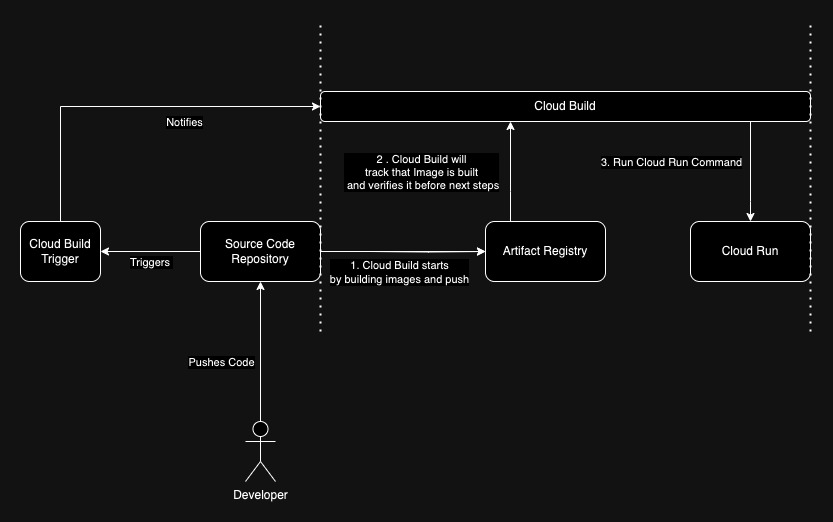

# Introduction 

Companies make use of continuous integration and deliveries to automate the building, compilation and release of applications developed. In this section, I will explain my experience in using Cloud Build to automate the release of repository code and deploy it on a serverless service on GCP (Cloud Run).

---
## Architecture 

 

 

Senario : Imagine you have a helloworld application in this folder and inside is the following : 

<pre>
|-- helloworldapp
   |-- app.py (simple web service / route)
   |-- config
   |-- docker
        |-- Dockerfile

|-- docker-compose.yml
|-- cloudbuild.yml

</pre>
1. A cloud build trigger needs to be created in order to set a listening on the a particular branch. The service allows anyone to connect to any code repository control. In this case we are using source code repository. 

2. Once a new version of the code is pushed and detected by the trigger, Cloud Build will begin to automate the building of the docker image. The docker image is build in reference to the docker compose file in the specific directory 

3. Once the image has between built, pushed, verified by Cloud Build, Cloud Build will procceed to Cloud Run commands. Cloud Run command in this case are "run deploy" command, which means, the Cloud Run will be redeployed with the new latest image. 

---
## Yaml Design

Explaning the cloudbuild.yml :

1. Copy all centralized configuration from the GCS into the config folder to ensure that centralised control is managed 

2. Access the docker compose builder to build the image given the name and speicfications in the docker compose file 

3. Assess the docker builder to push image to the artifact registry 

4. Access gcloud services gcloud run to refer to cloud run and run the deploy 

5. Added a way to add images to be used 

6. Subsititutions are like a way to sub text like constants